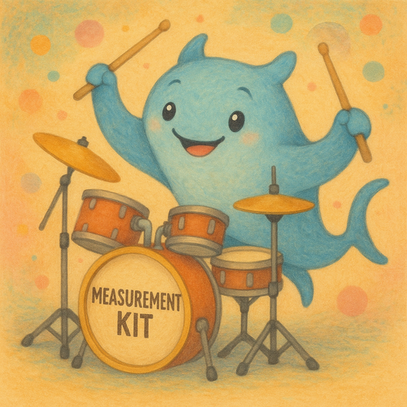

# Mini Measurement Kit

[](#build-instructions) [](#features) [](LICENSE)



Mini Measurement Kit (`minimk`) is a personal, hobby
project to reimplement [measurement-kit/measurement-kit](
https://github.com/measurement-kit/measurement) and
[measurement-kit/libndt](https://github.com/measurement-kit/libndt)
as a small C++11 library exposing a C API.

## Features

The project is in its early stage of development. The overall
implementation direction is the following:

1. C++11 without using exceptions, RTTI, or the C++ stdlib
to keep the binary size as small as possible and as free as
possible from bloated dependencies with the overall goal
(perhaps aspirational, but we will see) to weigh less than
1 MiB when compiled without debug symbols with `-O2`.

2. Cooperative single-threaded multitasking using coroutines
and suspend/resume on timers as well as I/O events (only
supporting sockets because Windows complicates supporting
other kinds of handles).

3. Support for the following targets `linux/amd64`, `linux/arm64`,
`windows/amd64`, `windows/arm64`, `darwin/arm64`. This should
include the ability to compile for Android and iOS.

4. Target-specific files side-by-side in the same directory (e.g.,
coroutine switching in assembly and specific wrappers around system
calls): `switch_linux_amd64.hpp`, `stack_windows.hpp`, etc.

5. Adopting secure coding standards and support testability by
splitting units into three subcomponents: (1) a C API inside
a C header file, (2) a testable template instantiated *at compile
time* with either actual or mocked dependencies, (3) a C++ file
that implements the C header by instantiating the corresponding
template using the actual dependencies. This provides us with
the ability to write testable code but also allows us to generate
this code at compile time and avoid some bloat.

6. Support DNS-over-UDP, TLSv1.3, HTTP/1.1, HTTP/2, DNS-over-TCP,
DNS-over-TLS, QUIC, HTTP/3 and DNS-over-QUIC. Support for the
running ndt7 network performance tests (hence we also need support
for JSON and WebSocket to implement this specific nettest).

7. Comprehensive tracing of the library functionality with the
option of emitting, in the future, JSON-formatted structured logs,
for easy post-processing, like [rbmk-project/rbmk](
https://github.com/rbmk-project/rbmk) does.

8. Prefer Entity-component-system (ECS) to complex object hierarchies.

The main drivers for this project are self-learning, curiosity to
understand how small the final library will be, and the aspiration to write
simple and self-documenting code that could be useful to others.

## Milestones (Long Term)

- [x] Basic networking I/O on `linux/amd64`.
- [ ] Ability to run ndt7 tests.
- [ ] ...

## Roadmap (Short Term)

- [x] Implement `errno` mapping for `linux/amd64`.
- [x] Implement accessing the monotonic clock for `linux/amd64`.
- [x] Implement syscall wrappers for `linux/amd64`.
- [x] Implement cooperative multitasking for `linux/amd64`.
- [x] Implement cooperative socket I/O for `linux/amd64`.
- [x] Structure the code for testability.
- [x] Add examples that also serve as integration tests.
- [ ] Implement `getpeername` and `getsockname`.
- [ ] Implement DNS-over-UDP.
- [ ] Write unit tests for the codebase.
- [ ] ...

## Architecture

| Path                             | Description                   |
| -------------------------------- | ----------------------------- |
| [include/minimk](include/minimk) | Contains the public headers.  |
| [libminimk](libminimk)           | Contains the project modules. |
| [examples](examples)             | Contains examples.            |
| [scripts](scripts)               | Contains helper scripts.      |
| [build.ninja](build.ninja)       | The build script.             |


### Major Modules

| Module                       | Description                                                                                                                                        |
| ---------------------------- | -------------------------------------------------------------------------------------------------------------------------------------------------- |
| [errno](libminimk/errno)     | Contains error management code, including mapping system errors to our error defines.                                                              |
| [syscall](libminimk/syscall) | Contains wrappers for the system calls that we support.                                                                                            |
| [runtime](libminimk/runtime) | Contains the cooperative runtime including switching coroutines cooperatively, suspending coroutines until a timer expires, and suspending on I/O. |
| [socket](libminimk/socket)   | Contains cooperative sockets that suspend as coroutines on I/O and have timeouts.                                                                  |

## Dependencies

This project relies on the following developer tools:

- `clang` and `clang++` — LLVM-based C/C++ compilers
- `ninja` — high-performance build system
- `iwyu` (Include-What-You-Use) — tools for include analysis
- `clang-format` — for code formatting
- `clangd` *(optional)* — language server, useful for IDE integration

To install these dependencies, use (on Debian "Trixie"):

```bash
sudo apt install -y build-essential clang clang-format clangd iwyu ninja-build
```

Debian Trixie ships with Clang ≥ 17 (Clang 19 is the default). Any
recent Clang should work with this project.

## Build Instructions

The project uses ninja for builds. Make sure dependencies are
installed before proceeding.

We currently do not track inter-file dependencies very well, as
such the recommended workflow is:

```bash
ninja -t clean && ninja
```

This command builds `libminimk.a` in the top-level directory
as well as examples inside [examples](examples).

There are currently no automated tests.

Examples serve as integration tests until a proper test suite is developed.

We recommend running these examples to confirm ~everything is still okay:

```bash
./examples/time/00_monotonic.exe
./examples/runtime/00_coroutine_hello.exe
./examples/runtime/01_coroutine_pingpong.exe
./examples/runtime/02_coroutine_sleep.exe
./examples/socket/01_echo_test.exe
```

After you modify files, please format them as follows:

```bash
clang-format -i <file1> <file2> ...
```

Also, use `iwyu` to ensure the includes are okay:

```bash
for file in <file1> <file2> ...; do
    iwyu -Iinclude $file
done
```

## License

```
SPDX-License-Identifier: GPL-3.0-or-later
```

See [LICENSE](LICENSE) for details.
